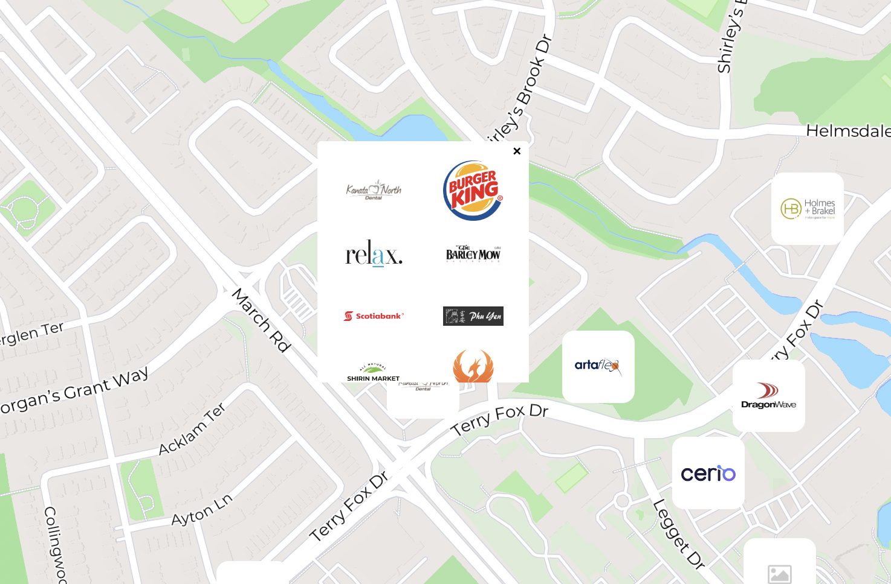
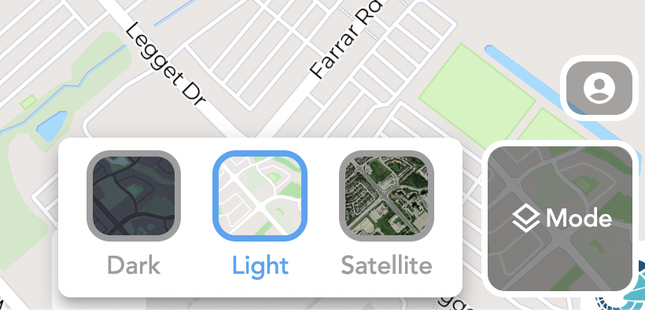
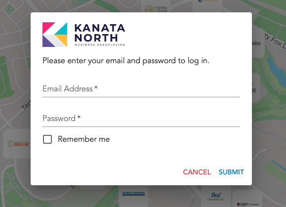
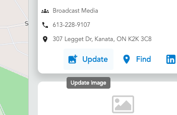

# Kanata Businees Map

# Hub350 Map

## Documentation

<br>

### 🌍 Getting Started with the Map

We've included the Mapbox JavaScript library in the application to show Mapbox maps on any browser. This not only lets you display maps but also adds cool features for users. You can customize the map's look and make it interactive, improving how users experience it
<br>

- #### Adding Mapbox as a Dependency

  To incorporate Mapbox functionality into the project, wee need to include Mapbox as a dependency. This allows the application to leverage the features and capabilities provided by the Mapbox library. Visit [React map GL](https://visgl.github.io/react-map-gl/)for more information

  ```
  npm install --save react-map-gl maplibre-gl
  ```

- #### Setting inital latitude, longitude, zoom and pitch

  By configuring initial values for latitude, longitude, zoom, and pitch, we gain control over where the map is initially displayed and what information is presented to the user.

  ```
    const [viewPort, setviewPort] = useState({
      latitude: 45.346577035886355,
      longitude: -75.91944575814581,
      zoom: 14,
      pitch: 0,
    });
  ```

- #### Adding Clusters to the Map for Grouping Companies with the Same Geolocation

  The incorporation of clusters on the map enables the grouping of companies sharing the same geolocation. For more detailed information on implementing clusters in React, you can refer to the [use-supercluster](https://github.com/leighhalliday/use-supercluster) GitHub repository. Additionally, check out this tutorial video on using [clusters in React](https://www.youtube.com/watch?v=3HYvbP2pQRA&t=468s&ab_channel=LeighHalliday).

  ```
  npm i supercluster use-supercluster
  ```

  

  ```
  const { clusters, supercluster } = useSupercluster({
  points,
  zoom: viewPort.zoom,
  bounds: bounds,
  options: { radius: phoneView ? 70 : 80, maxZoom: 18 },
  });
  ```

- #### Adding max bounds to the map

  Using the maxBounds parameter to define geographical boundaries on your map. This ensures a confined and tailored display, restricting the visible area to a specified region for an optimized user experience. For more information visit [Camera options](https://visgl.github.io/react-map-gl/docs/api-reference/map#camera-options)

  ```
   const maxBounds = {
      northeast: phoneView
        ? { latitude: 45.364, longitude: -75. 875 }
        : { latitude: 45.364, longitude: -75. 875 },
      southwest: phoneView
        ? { latitude: 45.327, longitude: -75. 957 }
        : { latitude: 45.327, longitude: -75. 957 },
    };
  ```

- #### Styling the Map with Mapbox Styles

  Mapbox provides a vast variety of map styles, such as [MapBox Streets](https://www.mapbox.com/maps/streets) and [Mapbox Outdoors](https://www.mapbox.com/maps/outdoors) . To access these styles, you need a valid [access token](https://docs.mapbox.com/help/glossary/access-token/). Beyond pre-built styles, Mapbox allows customization of map styles, empowering us to display the desired layers and information tailored to our specific needs. Visit [Styles](https://studio.mapbox.com/) for more details

    

- #### Custom Markers and Popups

  Enhance the map with custom markers, replacing default icons with company images for a personalized touch. Clustering groups of companies improves organization, and interactive popups triggered by these images provide a seamless way to explore and engage with multiple businesses in the same area, Visit [add custome icons](https://docs.mapbox.com/mapbox-gl-js/example/custom-marker-icons/)

  ```
    <ClusterMarker
        latitude={latitude}
        longitude={longitude}
        clusterId={cluster.id}
        setPopUpData={setPopUpData}
        setShowPopup={setShowPopup}
        cluster={supercluster.getLeaves(cluster.id)}
        />
  ```

### 🔒 Firebase Authentication, Database and Storage

we utilize [Firebase](https://firebase.google.com/docs/database/web/start) as a crucial tool to fortify our map application. We set up user [authentication](https://firebase.google.com/docs/auth), ensuring that only authorized users can update data. We explore role-based [database](https://firebase.google.com/docs/database) control, tailoring user access for reading or read-and-write permissions. Additionally, we delve into Firebase [storage](https://firebase.google.com/docs/storage) for secure image handling.

```
npm install firebase
npm i firebase-admin
```

```
import { initializeApp } from "firebase/app";
import {
  getFirestore,
  collection,
  getDocs,
  updateDoc,
  doc,
  getDoc,
} from "firebase/firestore";
import { deleteObject } from "firebase/storage";

import { getStorage, ref, uploadBytes, getDownloadURL } from "firebase/storage";
```

- ✅ Sigin wiht Email and password

```
import { signInWithEmailAndPassword } from "firebase/auth";
```



- 👥 Authenticated User Actions
  
- ❌ Signout

```
import { signOut } from "firebase/auth";

 function signOutUser() {
    signOut(auth);
    setIsAuthenticating(null);
    setUid(null);
    setUserRole(null);
  }
```

### 💅 Custom Styling and Theming

We use tools like [Material-UI](https://mui.com/) (MUI) and [Styled-Components](https://styled-components.com/) for an easy design process. With MUI's components, such as Box and Button, creating a polished and responsive map is straightforward. Incorporating Styled-Components and [SASS](https://sass-lang.com/) allows us to tailor the map's appearance to our preferences, ensuring a smooth and appealing user experience.

```
npm install @mui/material @mui/styled-engine-sc styled-components
npm i sass
```

- #### Desktop-Exclusive Sign-in Animation


- #### Desktop-Exclusive Mode view Animation and Style


- #### Desktop-Exclusived Drawer and Popup Animation and Styles


- #### Search Bar Styles

<br>
<br>

<br>
<br>

<br>

<br>

<br>

<br>

<br>
<br>

# Hub350
